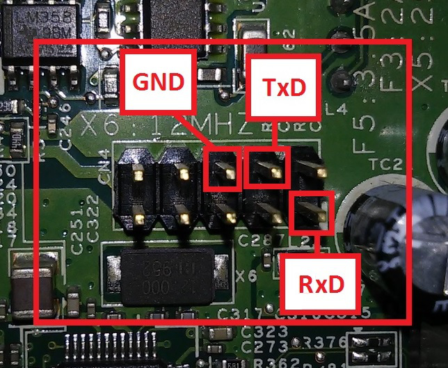

Run Debian on ix4-200d
----------------------

Everything here comes essentially from:

  - https://forum.doozan.com/read.php?2,22623
  - https://github.com/1000001101000/ix4-200d-research
  - https://download.lenovo.com/lenovoemc/na/en/app/cust_alp/p/1031%2c1087/c/73.html

> **DISCLAIMER NOTICE**
> * I'm not responsible for bricked devices, dead SD cards, thermonuclear war, or you getting fired because the alarm app failed (like it did for me...).
> * YOU are choosing to make these modifications, and if you point the finger at me for messing up your device, I will laugh at you.
> * Your warranty will be void if you tamper with any part of your device / software.
> 😘

# Serial boot

Serial: 115200 baud 3.3v:

    CN4
    --------------
    |  9 8 6 4 2 |
    | 10 7 5 3 1 |
    -------------- PIN 1 Mark (fat line)

    1 = RXD <--> TXD of USB Adapter
    4 = TXD <--> RXD of USB Adapter
    6 = GND <--> GND of USB Adapter
    10 = 3.3v (do not connect)

Open TTY with `screen`:

    screen -L /dev/ttyUSB0 115200

> Hint: press `ctrl + a` then type `:quit` to quit.

Start your device and press any key until `Hit any key to stop autoboot` is displayed. You should see u-boot prompt:

    Marvell>>

First, keep current u-boot parameters:

    printenv

> Keep the content of `printenv` [output](stock-firmware/uboot-printenv.txt). This will be a useful reference if you want to restore any u-boot parameters.

# Test new U-Boot with Serial port

    # You may need to build latest kwboot
    sudo apt-get install u-boot-tools

    kwboot -p -t -B 115200 /dev/ttyUSB0 -b ix4-200d-u-boot-2022.04.kwb

> Hint: press `ctrl + \` then type `c` to quit.

> If you got the following error, you need to use the latest version of kwboot, build it [from u-boot sources](u-boot/README.md):
>
>     Sending boot message. Please reboot the target...-
>     Sending boot image...
>     0 % [+xmodem: Protocol error

# Boot debian from usb

## Automatic boot with uEnv.txt

On USB key with debian, edit `/uEnv.txt`:

    x_bootargs=console=ttyS0,115200 mtdparts=${mtdparts} initramfs.runsize=32M usb-storage.delay_use=0 rootdelay=1 usbcore.autosuspend=-1 fsck.repair=preen
    x_bootargs_root=root=/dev/disk/by-path/platform-f1050000.ehci-usb-0:1.2:1.0-scsi-0:0:0:0-part1 rw rootfstype=ext2
    x_bootcmd_kernel=ext4load usb 0:1 ${loadaddr} /boot/uImage

From u-boot prompt:

    boot

## Detailed commands

    # Load from USB uEnv.txt file
    usb start
    ext4load usb 0:1 ${loadaddr} uEnv.txt
    env import -t ${loadaddr} ${filesize}

    # Or set mannually environments
    setenv x_bootargs console ttyS0,115200 mtdparts=${mtdparts} initramfs.runsize=32M usb-storage.delay_use=0 rootdelay=1 usbcore.autosuspend=-1 fsck.repair=preen
    setenv x_bootargs_root root=/dev/disk/by-path/platform-f1050000.ehci-usb-0:1.2:1.0-scsi-0:0:0:0-part1 rw rootfstype=ext2

    # Load uImage from USB
    ext4load usb 0:1 ${loadaddr} /boot/uImage

    # Then set kernel args and boot
    setenv bootargs ${x_bootargs} ${x_bootargs_root}
    bootm ${loadaddr}

# Persist new u-boot

If everything is OK, load `u-boot.kwb` from USB key:

    usb start
    ext4load usb 0:1 0x1000000 /u-boot.kwb

or from TFTP server:

    # setenv gatewayip 192.168.1.254
    setenv ipaddr 192.168.1.250
    tftpboot 0x1000000 192.168.1.48:u-boot.kwb

Then write it to nand:

    nand erase 0x000000 0xe0000
    nand write 0x1000000 0x000000 0xe0000
    env default -a
    env save
    reset

First, keep current new u-boot parameters:

    printenv

> Keep the content of `printenv` [output](new-firmware/uboot-printenv.txt). This will be a useful reference if you want to restore any u-boot parameters.

Set few env:

    setenv ethaddr 00:26:2d:06:ab:ac
    setenv eth1addr 00:26:2d:06:ab:ad
    env save
    reset

# Build U-Boot

    docker compose build --pull
    docker compose run uboot

> Debugging/testing
>
>     docker compose run uboot bash
>     ./build_uboot.sh

# Deboostrap debian

    docker compose build --pull
    docker compose run deboot

> For Debugging/Testing:
>
>     docker compose run deboot bash
>     ./deboot.sh armel buster http://ftp.fr.debian.org/debian/ openssh-server

# TFTP server

    sudo apt install tftpd-hpa
    sudo chmod a+rw /srv/tftp

From u-boot:

    # To set active ethernet port to the second one
    # setenv ethact ethernet-controller@76000

    setenv ethaddr 00:26:2d:06:ab:ac
    setenv eth1addr 00:26:2d:06:ab:ad

    setenv ipaddr 192.168.1.250
    setenv serverip 192.168.1.48

    ping ${serverip}
    tftpboot 0x0a00000 uImage
